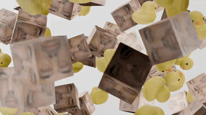

# Дискретная математика

Материалы по дисциплине «Дискретная математика» за 1 курс.

В папке собраны домашние задания за два семестра и курсовая работа. Основные
темы: логика, множества, отношения, графы, комбинаторика, булевы функции и
другие базовые разделы дискретной математики.

## Стек

