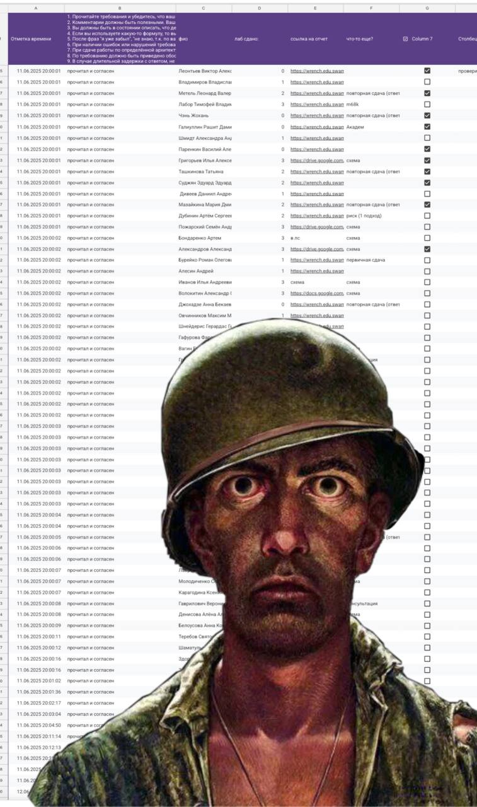

# Computer Science Basics

Materials for the first-year Computer Science Basics course.

## Labs

- `Lab2` - lab report in DOCX format.
- `Lab3` - Python tasks: arithmetic, strings, and regular expressions.
- `Lab4` - working with tabular data: CSV, Excel, `pandas`, and charts.
- `Lab5` - XML-to-YAML conversion and data parsing experiments.
- `Lab6` - report layout in TeX/LaTeX with sources, images, and PDF output.

## Stack

