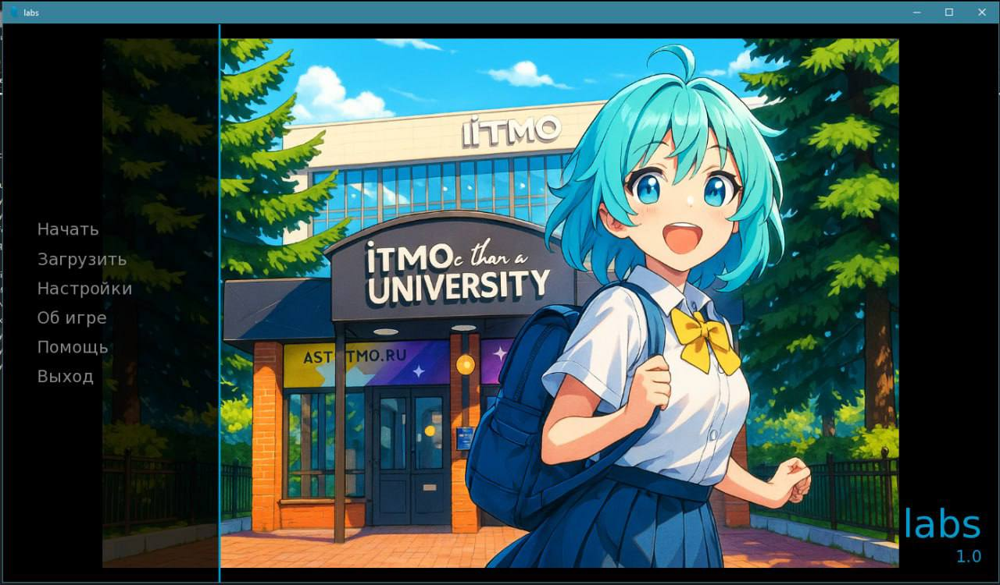

# Вычислительная математика

Материалы по дисциплине «Вычислительная математика» за 2 курс.

Код вынесен в сабмодуль [`all_labs`](all_labs/) и отдельный репозиторий:
[e345ee/Computational_Mathematics](https://github.com/e345ee/Computational_Mathematics).

## Лабораторные

Внутри проекта собран набор численных методов: приближение функций,
численное интегрирование, решение нелинейных уравнений и систем, решение ОДУ,
а также Java-модуль для интерполяции методами Лагранжа, Ньютона, Гаусса,
Стирлинга и Бесселя с построением графиков и тестами.

## Стек

