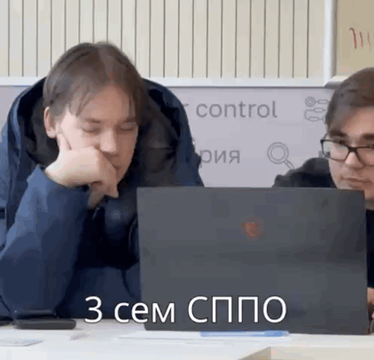
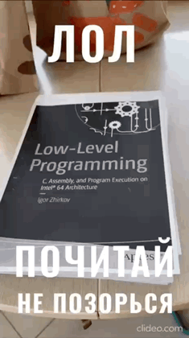

# Low-Level Programming

Materials for the second-year Low-Level Programming course.

## Labs

- `assignment-1-io-library` - x86-64 Assembly input/output library: strings,
  numbers, parsing, printing, and Linux system calls.
- `assignment-2-dictionary` - static Assembly dictionary: linked list, macros,
  key lookup, and console interface.
- `assignment-3-image-transform` - C utility for reading BMP files and applying
  geometric image transformations.
- `assignment-4-memory-allocator` - custom C memory allocator: `mmap`, blocks,
  headers, free-region merging, and tests.
- `seminar4` - seminar materials on Assembly and testing.

## Stack

