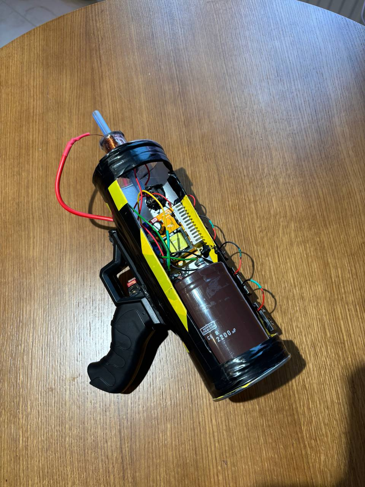
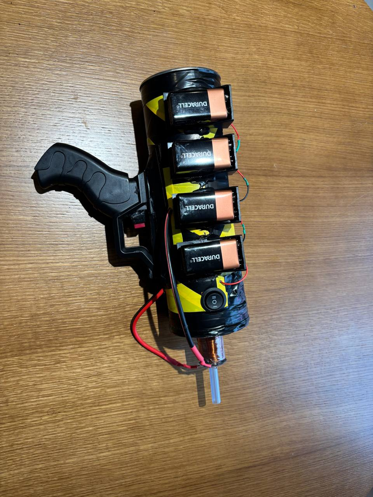
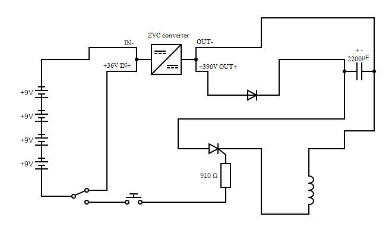

# ⚡ Портативная одноступенчатая пушка Гаусса

**Учебный проект по физике**, посвящённый разработке и демонстрации принципов работы электромагнитного ускорителя — пушки Гаусса.

> 📄 [Пояснительная записка](https://github.com/Umchik1222/MyITMOProjects/blob/main/2%20-%20Физика/semester_2/Проект_2/Пояснительная%20записка.pdf)

## 📷 Визуальные материалы

### 🎬 Демонстрация выстрела

### 🔧 Фото собранного устройства
| Вид сбоку | Вид с другого боку |
|----------|------------|
|  |  |

### 📊 Электрическая схема

## 🔍 Описание проекта

Устройство разгоняет ферромагнитную пулю с помощью короткого импульса тока через катушку. Создаваемое магнитное поле втягивает сердечник внутрь катушки, превращая накопленную электрическую энергию в кинетическую.

Принцип основан на законах:
- Электромагнитной индукции (Фарадей–Ленц)
- Сохранения энергии
- Ньютона (для расчёта движения пули)

📌 **Параметры проекта:**
- Ёмкость конденсатора: **2200 мкФ**
- Напряжение: **390 В**
- Масса пули: **6.62 г**
- Скорость пули: **13.6 м/с (из симуляции)** / **18.6 м/с (эксперимент)**
- КПД: **0.366% (симуляция)** / **0.514% (эксперимент)**

## 🧰 Использованные компоненты

- Конденсатор 400 В, 2200 мкФ
- Тиристор 40TPS12A (до 1200 В, 500 А)
- Повышающий модуль ZVS
- Медная катушка (761 виток, 42.5 м)
- Ствол из пластика (немагнитный)
- Источник питания: 4×9 В кроны
- Диод 1N4007 и резисторы

**Автор:** Umchik1222  
**Факультет:** ИТМО, Физика  
**Дата:** 2025  
