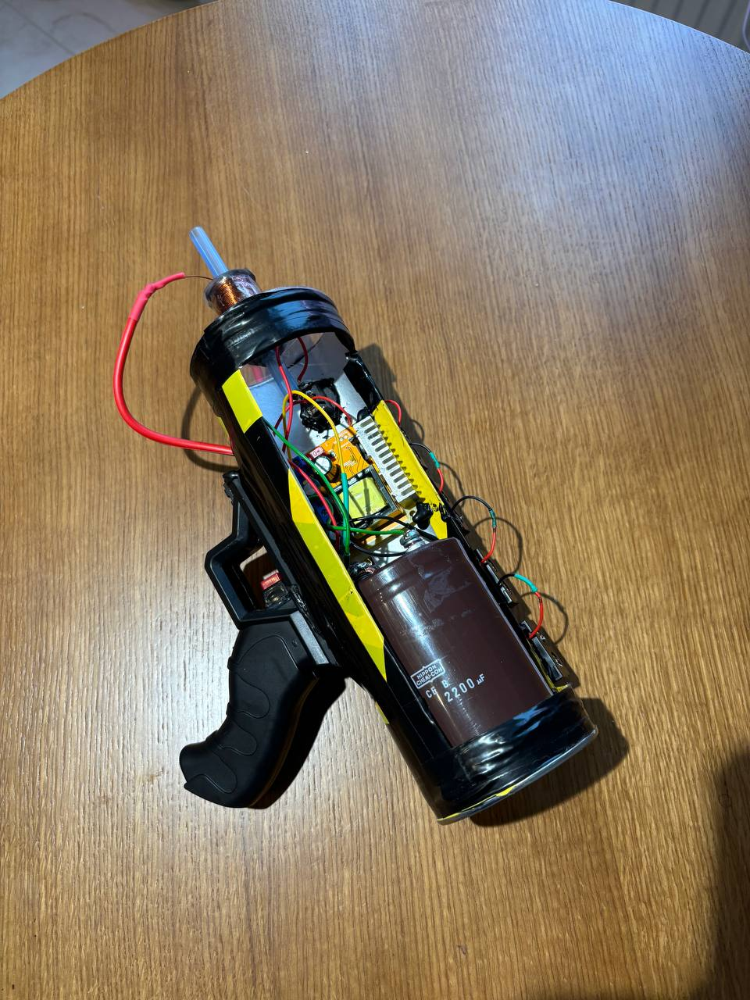
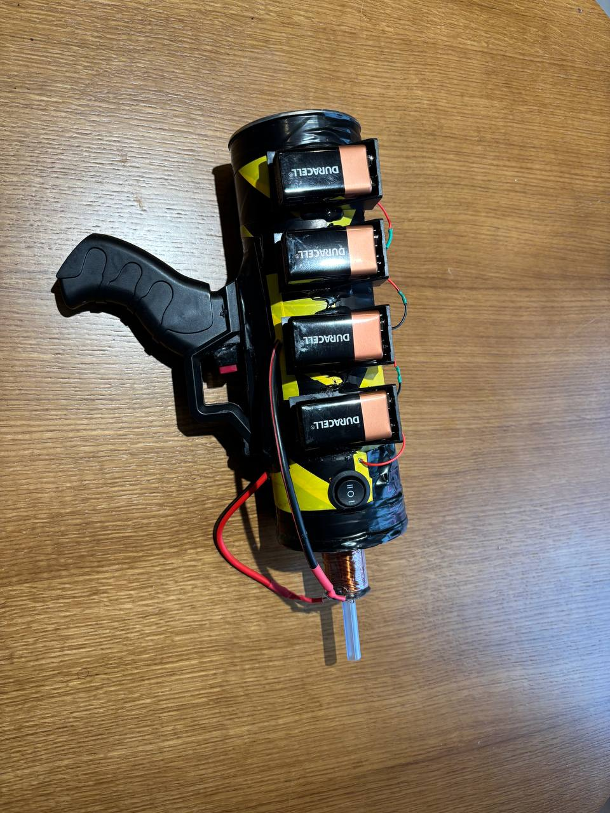

# ⚡ Portable Single-Stage Gauss Gun

**Educational physics project** focused on developing and demonstrating the operating principles of an electromagnetic accelerator: a Gauss gun.

> 📄 [Explanatory note](https://github.com/Umchik1222/MyITMOProjects/blob/main/2%20-%20%D0%A4%D0%B8%D0%B7%D0%B8%D0%BA%D0%B0/semester_2/%D0%9F%D1%80%D0%BE%D0%B5%D0%BA%D1%82_2/%D0%9F%D0%BE%D1%8F%D1%81%D0%BD%D0%B8%D1%82%D0%B5%D0%BB%D1%8C%D0%BD%D0%B0%D1%8F%20%D0%B7%D0%B0%D0%BF%D0%B8%D1%81%D0%BA%D0%B0.pdf)

## 📷 Visual Materials

### 🎬 Shot Demonstration

### 🔧 Assembled Device Photos
| Side view | Other side view |
|----------|------------|
|  |  |

### 📊 Electrical Circuit

## 🔍 Project Description

The device accelerates a ferromagnetic projectile using a short current pulse through a coil. The generated magnetic field pulls the core into the coil, converting stored electrical energy into kinetic energy.

The principle is based on:
- Electromagnetic induction (Faraday-Lenz law)
- Conservation of energy
- Newton's laws for calculating projectile motion

📌 **Project parameters:**
- Capacitor capacity: **2200 uF**
- Voltage: **390 V**
- Projectile mass: **6.62 g**
- Projectile speed: **13.6 m/s (simulation)** / **18.6 m/s (experiment)**
- Efficiency: **0.366% (simulation)** / **0.514% (experiment)**

## 🧰 Components Used

- 400 V, 2200 uF capacitor
- 40TPS12A thyristor (up to 1200 V, 500 A)
- ZVS boost module
- Copper coil (761 turns, 42.5 m)
- Plastic barrel (non-magnetic)
- Power supply: 4x9 V batteries
- 1N4007 diode and resistors

**Author:** Umchik1222  
**Faculty:** ITMO, Physics  
**Date:** 2025  
