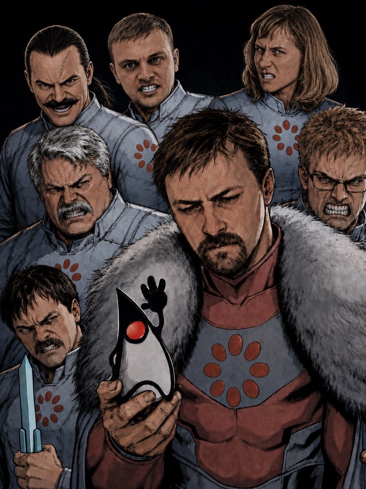

# Бизнес-логика программных систем

Материалы по дисциплине «Бизнес-логика программных систем» за 3 курс.

В репозитории представлены только лабораторные работы №3 и №4: третья
лабораторная развивала решения из ЛР1/ЛР2, а четвёртая перерабатывала
предыдущий бизнес-процесс под Camunda.

Предметная область обеих работ - процесс обработки откликов на вакансии
в системе, похожей на hh.ru: кандидат подаёт отклик, система выполняет
автоматический скрининг, рекрутер принимает решение, кандидат получает
уведомления и отвечает на приглашение.

## Ссылки

- [ЛР3: HH Process + Kafka](https://github.com/e345ee/hh-process-kafka)

  Доработка приложения из ЛР2: асинхронная обработка откликов через
  Apache Kafka и ZooKeeper, разделение ролей `app-api` и `app-worker`,
  плановые задачи через `@Scheduled`, WebSocket-уведомления и интеграция
  с внешней EIS/Odoo через JCA.

  
  
  
  
  
  
  
  
  
  
  
  
  
  

- [ЛР4: HH Process + Camunda](https://github.com/e345ee/hh-process-camunda)

  Переработка процесса на BPMS: бизнес-логика вынесена в BPMN 2.0 и DMN,
  Camunda работает как standalone-сервис, пользовательские действия
  доступны через Camunda Tasklist и Forms, а Spring Boot-приложение
  выполняет бизнес-операции через external tasks и разворачивается на
  WildFly.

  
  
  
  
  
  
  
  
  
  
  
  
  
  

## Кратко по работам

- ЛР3 - реализация асинхронного скрининга заявок по модели подписки: `application.submitted` -> worker -> `application.screened`, распределение обработки между узлами, закрытие просроченных приглашений и экспорт интервью во внешнюю EIS.
- ЛР4 - перенос управляющей логики в Camunda: процессы вакансии, отклика, отмены интервью, изменения статуса вакансии, обработки таймаутов и уведомлений; автоскрининг и шаблоны уведомлений вынесены в DMN.
