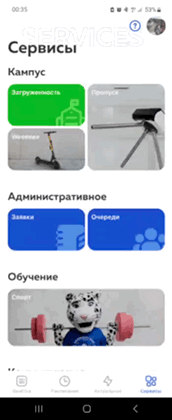

# Operating Systems

Materials for the third-year Operating Systems course.

## Labs

- `ass_1-3` - a series of labs on an educational Unix-like OS in the style of
  `xv6`: kernel changes, system calls, processes, scheduling, signals, virtual
  memory, lazy allocation, copy-on-write, and user-space tests.
- `ass_4` - the `VTFS` virtual file system: C backend implementations, HTTP
  interaction, and a Java server for working with file storage.

## Stack

