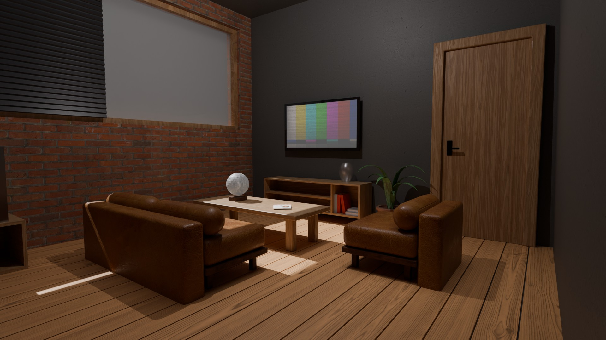

# Создание виртуального интерьера

Данный проект выполнен в рамках дисциплины  
«Полигональное моделирование».

Проект представляет собой 3D-модель интерьера комнаты,
разработанную и оптимизированную для дальнейшего импорта
в игровой движок.

## Скачать

[Ссылка на скачивание](https://drive.google.com/file/d/1b--E-91rkcuaTpz3twA8b0w254AoTbJ/view?usp=sharing)

---

## Превью



---

## Цель работы

Создать виртуальный интерьер и подготовить его для импорта
в движок с соблюдением технических ограничений и требований
к оптимизации сцены.

## Техническое задание

Интерьер должен включать:

- стены с дверью  
- кресло и диван  
- стол  
- телевизор  
- тумбу под телевизор  
- сейф  
- ключ  
- декор (вазы, книги, мини-статуи)  
- светильники  

Дополнительные требования:

- все объекты выполнены разными методами моделирования  
- корректная UV-развёртка для всех моделей  
- материалы оптимизированы под игровой движок (используются запечённые текстуры)  
- сцена содержит настроенное освещение  
- подготовлены финальные рендеры  
- общий лимит геометрии: не более 10 000 полигонов  
- проект подготовлен к импорту в движок  

## Этапы работы

1. Сбор референсов и анализ интерьерных решений  
2. Планировка пространства  
3. Моделирование объектов интерьера  
4. UV-развёртка  
5. Текстурирование  
6. Ретопология  
7. Запекание текстур  
8. Оптимизация геометрии  
9. Настройка освещения сцены  
10. Финальный рендер  
11. Подготовка сцены к экспорту  

## Использованные техники

- полигональное моделирование  
- работа с модификаторами  
- ретопология  
- UV-развёртка  
- текстурирование  
- запекание карт (baking)  
- оптимизация под игровой движок  
- настройка освещения  

## Структура проекта

```
3 - Полигональное моделирование/
└─ Проект/
   ├─ Рендеры/       # финальные рендеры сцены
   ├─ report.pdf     # отчёт / презентация по проекту
   └─ README.md
```

## Результат

В результате был создан виртуальный интерьер,
соответствующий требованиям технического задания:

- все ключевые объекты интерьера смоделированы вручную  
- сцена оптимизирована по количеству полигонов  
- материалы подготовлены для импорта в движок  
- настроено освещение  
- выполнены финальные рендеры  

Проект готов для дальнейшего использования
в игровом движке или интерактивном приложении.

