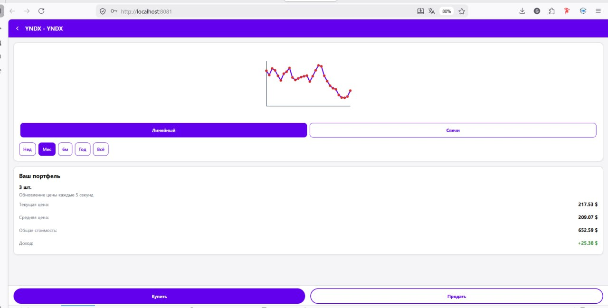
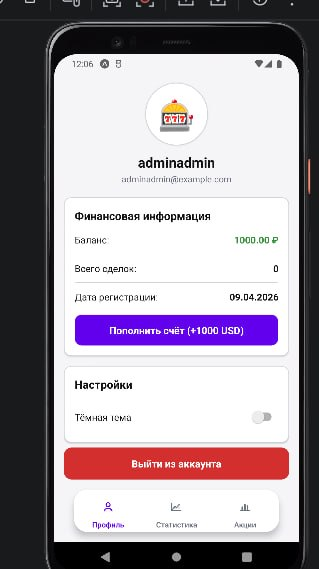
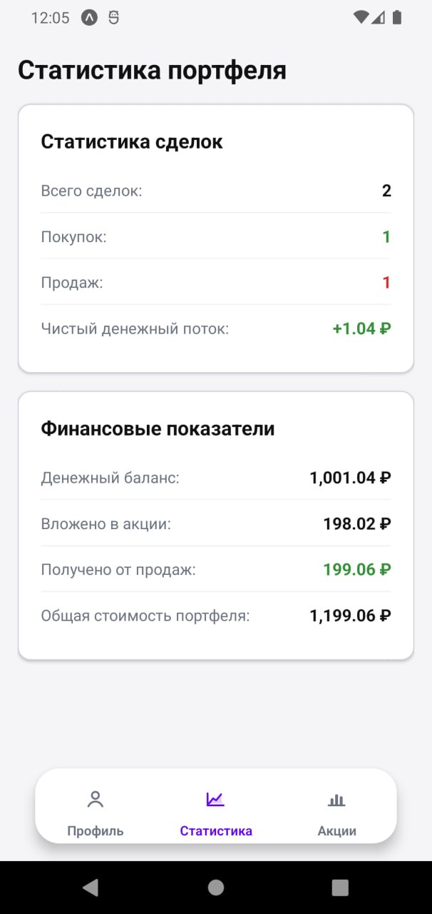

# Разработка мобильных приложений

Материалы по дисциплине «Разработка мобильных приложений» за 3 курс.

Командный проект из 6 человек: биржевое приложение для просмотра акций,
работы с портфелем, покупки и продажи бумаг, просмотра статистики и
профиля пользователя. В команде были разделены зоны ответственности:
backend, Android-приложение на Kotlin и клиентская часть на React Native.

Моя часть проекта - кроссплатформенное приложение на **React Native**.

## Ссылки

- [React Native приложение](https://github.com/e345ee/React-Native-humster) - моя клиентская часть: авторизация, список акций, карточка инструмента, покупка/продажа, портфель, статистика, профиль и светлая/тёмная тема.
- [Android/Kotlin приложение](https://github.com/MaryShust/Stock-Exchange) - нативный Android-клиент коллег: экраны входа, профиля, статистики, списка акций и графиков.
- [Общий проект и backend](https://github.com/skadibtw/stock-tracker-app) - multi-module репозиторий с mobile API, backend-сервисом портфеля, сервисом котировок, драйвером котировок и Docker-инфраструктурой.

## Стек моей части

## Стек Android-приложения

## Стек backend и инфраструктуры

## Скриншоты

| Карточка акции | Профиль | Статистика |
|---|---|---|
|  |  |  |
